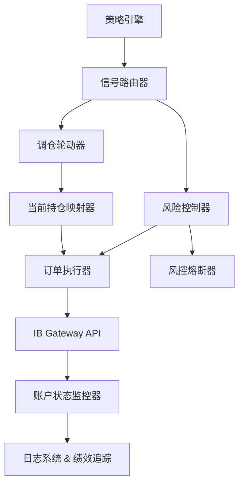

# 系统模块结构图

```mermaid
graph TD
A[策略引擎] --> B[信号路由器]
B --> C[风险控制器]
C --> D[订单执行器]
D --> E[IB Gateway API]
E --> F[账户状态监控器]
C --> G[风控熔断器]
B --> H[调仓轮动器]
H --> I[当前持仓映射器]
I --> D
F --> Z[日志系统 & 绩效追踪]
```